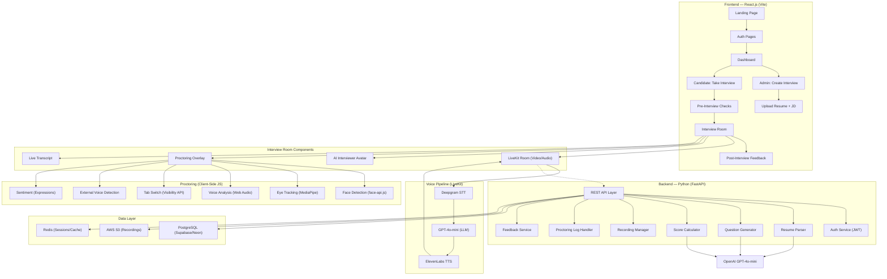

# Virtual AI Interview Agent — Implementation Plan v2

> **Stack**: Python (FastAPI) Backend + React.js (Vite) Frontend + LiveKit Voice Pipeline
> Inspired by TensorGo (Zai), Mercer|Mettl, HireNext, and Talview.

---

## 🎙️ Voice Pipeline: LiveKit vs VAPI — Verdict

> [!IMPORTANT]
> **Recommendation: LiveKit** — For an AI interview agent, **LiveKit is the clear winner**. Here's why:

| Criteria | LiveKit ✅ (Recommended) | VAPI ❌ |
|----------|--------------------------|---------|
| **Latency** | **< 500ms** (tunable, WebRTC-native) | 700ms–1,500ms (managed, less control) |
| **Cost per minute** | **$0.01/min** (Cloud) or **$0** (self-hosted) | **$0.05/min** platform + providers = **$0.15–$0.33/min total** |
| **Control** | Full pipeline control (swap STT/TTS/LLM freely) | Locked into their orchestration layer |
| **Self-hosting** | ✅ Open source, run on your own servers | ❌ Fully managed only |
| **Dual camera** | ✅ Native WebRTC rooms, multi-track support | ❌ Voice-only, no video |
| **Recording** | ✅ Built-in composite recording (Egress API) | ❌ Audio-only recording |
| **Interview use case** | ✅ Video + Voice + Recording in one platform | ❌ Designed for phone/voice bots only |
| **Scalability** | ✅ Handles 500+ concurrent sessions | ⚠️ Depends on their infrastructure |
| **Data privacy** | ✅ Self-host = full data control | ⚠️ Data passes through VAPI servers |

> [!TIP]
> **Why LiveKit wins for interviews**: VAPI is built for **phone call bots** (telephony-first). LiveKit is built for **real-time video/audio rooms** — exactly what an interview needs. LiveKit gives you video, voice AI, recording, and dual-camera all in one platform. With VAPI, you'd still need a separate video solution.

### Recommended Voice Pipeline Stack (with LiveKit):
```
Candidate speaks → LiveKit Room (WebRTC)
  → Deepgram Nova-3 (STT: $0.0077/min, fastest)
  → OpenAI GPT-4o-mini (LLM: ~$0.01/min)
  → ElevenLabs Flash / Cartesia Sonic (TTS: ~$0.02/min)
  → LiveKit Room → Candidate hears AI response

Total voice pipeline cost: ~$0.04–$0.06/min
vs VAPI total: ~$0.15–$0.33/min

Savings: 3x–8x cheaper with LiveKit
```

---

## 💰 Complete Budget Breakdown

### A. Per-Interview Cost (30-min interview)

| Component | Provider | Cost per Min | Cost per Interview (30 min) |
|-----------|----------|-------------|---------------------------|
| **Voice Pipeline (LiveKit Cloud)** | LiveKit | $0.01 | $0.30 |
| **Speech-to-Text** | Deepgram Nova-3 | $0.0077 | $0.23 |
| **LLM (Questions + Scoring)** | OpenAI GPT-4o-mini | ~$0.01 | $0.30 |
| **Text-to-Speech** | ElevenLabs / Cartesia | ~$0.02 | $0.60 |
| **Recording Storage** | AWS S3 (~500MB/interview) | $0.023/GB | $0.01 |
| **Proctoring AI** | face-api.js / MediaPipe | FREE (client-side) | $0.00 |
| **Resume Parsing** | OpenAI GPT-4o-mini (one-time) | — | $0.005 |
| | | **TOTAL PER INTERVIEW** | **$1.45** |

> [!NOTE]
> At scale (1000+ interviews/month), self-hosting LiveKit + using open-source STT (Whisper) can bring this down to **~$0.35/interview**.

---

### B. Monthly Infrastructure Costs

#### 🟢 Tier 1: MVP / Startup (0–100 interviews/month)

| Service | Provider | Monthly Cost |
|---------|----------|-------------|
| **Backend Hosting** | Railway / Render (Python FastAPI) | $5–$25 |
| **Frontend Hosting** | Vercel (React — free tier) | $0 |
| **Database** | Supabase Free / Neon Free (PostgreSQL) | $0 |
| **LiveKit Cloud** | LiveKit (Build plan) | $0 (free tier) |
| **OpenAI API** | GPT-4o-mini | $5–$30 |
| **Deepgram** | Pay-as-you-go STT | $3–$15 |
| **ElevenLabs** | Starter plan TTS | $5–$22 |
| **AWS S3** | Video storage (50GB) | $1.15 |
| **Domain + SSL** | Cloudflare / Namecheap | $1–$5 |
| | **TOTAL MONTHLY** | **$20–$100** |

#### 🟡 Tier 2: Growth (100–1,000 interviews/month)

| Service | Provider | Monthly Cost |
|---------|----------|-------------|
| **Backend Hosting** | AWS EC2 / DigitalOcean (2 vCPU, 4GB) | $25–$50 |
| **Frontend Hosting** | Vercel Pro | $20 |
| **Database** | Supabase Pro / Neon Pro | $25–$50 |
| **LiveKit Cloud** | Ship plan | $50 |
| **OpenAI API** | GPT-4o-mini (higher volume) | $30–$150 |
| **Deepgram** | Growth plan STT | $30–$80 |
| **ElevenLabs** | Pro plan TTS | $99 |
| **AWS S3** | Video storage (500GB) | $11.50 |
| **CloudFront CDN** | Video delivery | $10–$30 |
| **Monitoring** | Sentry + Datadog Free | $0–$30 |
| | **TOTAL MONTHLY** | **$300–$570** |

#### 🔴 Tier 3: Enterprise (1,000–10,000 interviews/month)

| Service | Provider | Monthly Cost |
|---------|----------|-------------|
| **Backend** | AWS ECS / Kubernetes (auto-scaling) | $200–$800 |
| **Frontend** | Vercel Enterprise / Self-hosted | $100–$500 |
| **Database** | AWS RDS PostgreSQL / Supabase Enterprise | $100–$400 |
| **LiveKit** | Self-hosted (Kubernetes) | $50–$200 (infra only) |
| **OpenAI API** | GPT-4o-mini (enterprise volume) | $200–$1,000 |
| **Deepgram** | Enterprise plan | $200–$500 |
| **ElevenLabs** | Scale/Business plan | $330–$1,320 |
| **AWS S3 + CDN** | 5TB+ storage | $150–$500 |
| **Security / Compliance** | WAF, DDoS protection | $100–$300 |
| | **TOTAL MONTHLY** | **$1,430–$5,520** |

---

### C. One-Time Development Costs

| Item | DIY (You Build) | Freelancer | Agency |
|------|-----------------|-----------|--------|
| **Full Platform Build** | $0 (your time) | $3,000–$8,000 | $15,000–$40,000 |
| **Domain Name** | $10–$15/year | — | — |
| **SSL Certificate** | Free (Let's Encrypt) | — | — |
| **AI Model Weights** | Free (face-api.js, MediaPipe) | — | — |
| **LiveKit SDK** | Free (open source) | — | — |

---

### D. Budget Summary

| Scenario | Monthly Cost | Per Interview | Annual Cost |
|----------|-------------|--------------|-------------|
| **MVP** (50 interviews) | **$20–$100** | **~$1.45** | **$240–$1,200** |
| **Growth** (500 interviews) | **$300–$570** | **~$0.80** | **$3,600–$6,840** |
| **Enterprise** (5,000 interviews) | **$1,430–$5,520** | **~$0.50** | **$17,160–$66,240** |

> [!TIP]
> **Cost optimization tip**: Use GPT-4o-mini instead of GPT-4o (16x cheaper), Deepgram instead of OpenAI Whisper API (faster + cheaper), and self-host LiveKit when crossing 1000 interviews/month.

---

## Architecture Overview



---

## Proposed Changes

### Phase 1: Project Setup & Structure

#### [NEW] Backend — Python (FastAPI)

```
backend/
├── app/
│   ├── __init__.py
│   ├── main.py                        # FastAPI app entry
│   ├── config.py                      # Settings (env vars, API keys)
│   ├── database.py                    # SQLAlchemy engine + session
│   ├── models/                        # SQLAlchemy ORM models
│   │   ├── __init__.py
│   │   ├── user.py
│   │   ├── interview.py
│   │   ├── question.py
│   │   ├── response.py
│   │   ├── proctoring_log.py
│   │   └── feedback.py
│   ├── schemas/                       # Pydantic request/response schemas
│   │   ├── __init__.py
│   │   ├── user.py
│   │   ├── interview.py
│   │   ├── question.py
│   │   └── feedback.py
│   ├── api/                           # REST API routers
│   │   ├── __init__.py
│   │   ├── auth.py                    # POST /auth/register, /auth/login
│   │   ├── interviews.py             # CRUD interviews
│   │   ├── questions.py              # Generate + manage questions
│   │   ├── resume.py                 # Upload + parse resume
│   │   ├── proctoring.py             # Log violations
│   │   ├── recording.py              # Upload/download recordings
│   │   ├── feedback.py               # Submit/get feedback
│   │   └── livekit_token.py          # Generate LiveKit room tokens
│   ├── services/                      # Business logic
│   │   ├── __init__.py
│   │   ├── ai_service.py             # OpenAI integration
│   │   ├── resume_parser.py          # PDF/DOCX parsing + AI extraction
│   │   ├── question_generator.py     # AI question generation
│   │   ├── score_calculator.py       # Score computation
│   │   ├── sentiment_analyzer.py     # Text sentiment analysis
│   │   ├── livekit_service.py        # LiveKit room/token management
│   │   ├── recording_service.py      # S3 upload/download
│   │   └── email_service.py          # Notifications
│   ├── middleware/                     # Auth, CORS, rate limiting
│   │   ├── auth_middleware.py
│   │   └── cors.py
│   └── utils/
│       ├── security.py                # JWT, password hashing
│       └── helpers.py
├── alembic/                           # Database migrations
│   └── versions/
├── requirements.txt
├── alembic.ini
├── Dockerfile
└── .env
```

**Key Dependencies (`requirements.txt`):**
```
fastapi==0.115.*
uvicorn[standard]==0.32.*
sqlalchemy==2.0.*
alembic==1.14.*
asyncpg==0.30.*
python-jose[cryptography]==3.3.*
passlib[bcrypt]==1.7.*
python-multipart==0.0.*
openai==1.60.*
pdf2image==1.17.*
pdfplumber==0.11.*
python-docx==1.1.*
boto3==1.35.*
livekit-api==0.7.*
livekit-agents==0.12.*
deepgram-sdk==3.*
redis==5.*
httpx==0.28.*
pydantic-settings==2.*
```

---

#### [NEW] Frontend — React.js (Vite)

```
frontend/
├── public/
│   ├── models/                        # face-api.js model weights
│   │   ├── ssd_mobilenetv1/
│   │   ├── face_landmark_68/
│   │   └── face_expression/
│   └── assets/
├── src/
│   ├── main.jsx                       # App entry
│   ├── App.jsx                        # Root with router
│   ├── index.css                      # Global styles + design tokens
│   ├── pages/                         # Page components
│   │   ├── Landing.jsx
│   │   ├── Login.jsx
│   │   ├── Register.jsx
│   │   ├── Dashboard.jsx
│   │   ├── AdminPanel.jsx
│   │   ├── InterviewSetup.jsx         # Pre-interview checks
│   │   ├── InterviewRoom.jsx          # Main interview room
│   │   └── InterviewFeedback.jsx      # Post-interview report
│   ├── components/
│   │   ├── ui/                        # Button, Card, Modal, Input, Badge...
│   │   ├── interview/
│   │   │   ├── AIAvatar.jsx
│   │   │   ├── VideoFeed.jsx
│   │   │   ├── QuestionDisplay.jsx
│   │   │   ├── LiveTranscript.jsx
│   │   │   ├── InterviewTimer.jsx
│   │   │   └── PhoneCameraQR.jsx
│   │   ├── proctoring/
│   │   │   ├── ProctoringOverlay.jsx
│   │   │   ├── FaceDetectionStatus.jsx
│   │   │   ├── EyeTrackingIndicator.jsx
│   │   │   ├── TabSwitchWarning.jsx
│   │   │   └── VoiceActivityBar.jsx
│   │   ├── feedback/
│   │   │   ├── ScoreCard.jsx
│   │   │   ├── CategoryBreakdown.jsx
│   │   │   └── FeedbackForm.jsx
│   │   └── layout/
│   │       ├── Navbar.jsx
│   │       ├── Sidebar.jsx
│   │       └── Footer.jsx
│   ├── lib/
│   │   ├── api.js                     # Axios/fetch API client
│   │   ├── proctoring/
│   │   │   ├── faceDetector.js        # face-api.js integration
│   │   │   ├── eyeTracker.js          # MediaPipe Face Mesh
│   │   │   ├── voiceDetector.js       # Web Audio API analysis
│   │   │   ├── tabMonitor.js          # Visibility API tracker
│   │   │   └── externalVoice.js       # Voice profile comparator
│   │   ├── media/
│   │   │   ├── recorder.js            # MediaRecorder wrapper
│   │   │   ├── dualCamera.js          # WebRTC phone camera
│   │   │   └── streamMixer.js         # Canvas-based stream mixer
│   │   └── livekit/
│   │       └── livekitClient.js       # LiveKit room connection
│   ├── hooks/
│   │   ├── useProctoring.js
│   │   ├── useRecording.js
│   │   ├── useInterview.js
│   │   ├── useNetworkStatus.js
│   │   └── useLiveKit.js
│   ├── stores/                        # Zustand state management
│   │   ├── authStore.js
│   │   ├── interviewStore.js
│   │   └── proctoringStore.js
│   └── utils/
│       ├── constants.js
│       └── helpers.js
├── package.json
├── vite.config.js
└── .env
```

**Key Dependencies (`package.json`):**
```json
{
  "dependencies": {
    "react": "^19.0.0",
    "react-dom": "^19.0.0",
    "react-router-dom": "^7.x",
    "@livekit/components-react": "^2.x",
    "livekit-client": "^2.x",
    "face-api.js": "^0.22.2",
    "@mediapipe/face_mesh": "^0.4.x",
    "@mediapipe/camera_utils": "^0.3.x",
    "zustand": "^5.x",
    "axios": "^1.x",
    "framer-motion": "^12.x",
    "recharts": "^2.x",
    "qrcode.react": "^4.x",
    "react-hot-toast": "^2.x",
    "lucide-react": "^0.4x",
    "socket.io-client": "^4.x"
  }
}
```

---

### Phase 2: Design System & Premium UI

#### [NEW] `frontend/src/index.css` — Design System

- **Dark-mode-first** premium design with glassmorphism
- CSS custom properties: colors (deep navy/purple gradients), spacing scale, border-radius, shadows
- Google Fonts: **Inter** (body) + **Outfit** (headings)
- Micro-animations: hover glows, smooth transitions, skeleton loaders
- Responsive breakpoints for all screen sizes

#### [NEW] `frontend/src/components/ui/` — Component Library

| Component | Features |
|-----------|----------|
| `Button` | Primary (gradient), secondary, danger, ghost, loading spinner |
| `Card` | Glassmorphic, hover-lift, glow border |
| `Modal` | Animated overlay, backdrop blur |
| `Input` | Floating labels, validation states |
| `Badge` | Pulse animation (Live, Recording, Warning) |
| `Progress` | Animated ring + bar variants |
| `Timer` | Circular countdown with urgency colors |
| `Alert` | Slide-in proctoring warnings |

---

### Phase 3: Auth & Database

#### [NEW] `backend/app/models/` — SQLAlchemy Models

Database schema (PostgreSQL):

```
┌──────────────┐    ┌──────────────────┐    ┌──────────────┐
│    Users      │    │   Interviews      │    │  Questions    │
├──────────────┤    ├──────────────────┤    ├──────────────┤
│ id (PK)      │◄──┤ user_id (FK)      │◄──┤ interview_id  │
│ email        │    │ title             │    │ text          │
│ password_hash│    │ job_description   │    │ category      │
│ name         │    │ resume_text       │    │ difficulty    │
│ role         │    │ status            │    │ expected_keys │
│ created_at   │    │ match_score       │    │ order         │
└──────────────┘    │ overall_score     │    └──────┬───────┘
                    │ tab_switch_count  │           │
                    │ recording_url     │    ┌──────▼───────┐
                    │ scheduled_at      │    │  Responses    │
                    │ started_at        │    ├──────────────┤
                    │ ended_at          │    │ question_id   │
                    └────────┬─────────┘    │ answer_text   │
                             │              │ score         │
                    ┌────────▼─────────┐    │ sentiment     │
                    │ Proctoring_Logs   │    │ confidence    │
                    ├──────────────────┤    │ feedback      │
                    │ interview_id      │    └──────────────┘
                    │ type              │
                    │ severity          │    ┌──────────────┐
                    │ details           │    │  Feedbacks    │
                    │ timestamp         │    ├──────────────┤
                    └──────────────────┘    │ interview_id  │
                                            │ type          │
                                            │ rating        │
                                            │ scores...     │
                                            │ strengths     │
                                            │ improvements  │
                                            └──────────────┘
```

#### REST API Endpoints:

| Method | Endpoint | Description |
|--------|----------|-------------|
| POST | `/api/auth/register` | Register new user |
| POST | `/api/auth/login` | Login, returns JWT |
| GET | `/api/auth/me` | Get current user profile |
| POST | `/api/interviews` | Create new interview (admin) |
| GET | `/api/interviews` | List interviews |
| GET | `/api/interviews/{id}` | Get interview details |
| PATCH | `/api/interviews/{id}/status` | Update interview status |
| POST | `/api/resume/upload` | Upload + parse resume |
| POST | `/api/questions/generate` | AI-generate questions from resume+JD |
| GET | `/api/questions/{interview_id}` | Get questions for interview |
| POST | `/api/responses` | Submit candidate answer |
| POST | `/api/proctoring/log` | Log a proctoring violation |
| GET | `/api/proctoring/{interview_id}` | Get proctoring summary |
| POST | `/api/recording/upload` | Upload recording chunk/file |
| GET | `/api/recording/{interview_id}` | Get recording URL |
| POST | `/api/feedback` | Submit feedback (candidate or system) |
| GET | `/api/feedback/{interview_id}` | Get interview feedback/report |
| POST | `/api/livekit/token` | Generate LiveKit room access token |
| POST | `/api/interviews/{id}/reschedule` | Request reschedule (internet issue) |

---

### Phase 4: AI Engine (Python Services)

#### [NEW] `backend/app/services/resume_parser.py`

- Parse PDF with `pdfplumber`, DOCX with `python-docx`
- Send extracted text to GPT-4o-mini with structured output
- Extract: name, email, skills, experience, education, projects
- Return structured JSON

#### [NEW] `backend/app/services/question_generator.py`

- Input: parsed resume + job description
- Calls OpenAI GPT-4o-mini with function calling
- Generates 10-15 questions across categories:
  - Technical (40%) — based on skills vs JD requirements
  - Behavioral (30%) — STAR method questions
  - Situational (20%) — role-specific scenarios
  - Gap Analysis (10%) — probing missing JD skills
- Returns: `[{ question, category, difficulty, expectedKeyPoints }]`

#### [NEW] `backend/app/services/score_calculator.py`

- Evaluates each answer against expected key points via GPT-4o-mini
- Per-question score (0-100)
- Overall weighted score:
  - Technical Knowledge: **40%**
  - Communication Quality: **20%**
  - Problem Solving: **20%**
  - Confidence & Sentiment: **10%**
  - Proctoring Integrity: **10%**

#### [NEW] `backend/app/services/livekit_service.py`

- Generate LiveKit room tokens (access tokens with room permissions)
- Create/manage LiveKit rooms for each interview session
- Configure LiveKit Agents for AI voice pipeline:
  - Deepgram STT → GPT-4o-mini → ElevenLabs TTS
- Handle recording via LiveKit Egress API

---

### Phase 5: Proctoring Engine (Client-Side JavaScript)

> All proctoring runs **client-side** in the browser using TensorFlow.js / face-api.js — no video data sent to server for AI analysis (privacy-first).

#### [NEW] `frontend/src/lib/proctoring/faceDetector.js`

- **face-api.js** with SSD MobileNet v1
- Detects: face presence, multi-face, face landmarks
- Alert if no face for >3 seconds
- Flag if >1 face detected
- Runs at 5-10 FPS on `requestAnimationFrame`

#### [NEW] `frontend/src/lib/proctoring/eyeTracker.js`

- **MediaPipe Face Mesh** (468 landmarks)
- Tracks iris position vs. eye corners
- Detects: looking away (>30° deviation), looking down, sustained off-screen gaze (>5s)
- Generates gaze data for post-interview analysis

#### [NEW] `frontend/src/lib/proctoring/voiceDetector.js`

- **Web Audio API** (`AudioContext` + `AnalyserNode`)
- Monitor speaking vs. silence, volume levels
- Detect external/background voices via frequency analysis
- Whisper detection

#### [NEW] `frontend/src/lib/proctoring/tabMonitor.js`

- **Page Visibility API** + `window.blur` events
- Tab switch 1 → ⚠️ Warning modal
- Tab switch 2 → ⚠️⚠️ Final warning modal
- Tab switch 3 → 🛑 **Auto-terminate interview**
- All switches logged to backend via API

#### [NEW] `frontend/src/lib/proctoring/externalVoice.js`

- Build candidate voice profile in first 30 seconds
- Compare ongoing audio via FFT spectral analysis
- Flag significantly different voice patterns

---

### Phase 6: Interview Room (Core Experience)

#### [NEW] `frontend/src/pages/InterviewRoom.jsx`

```
┌──────────────────────────────────────────────────────────┐
│  🔴 REC  │  Interview: Senior React Developer  │ ⏱ 28:45  │
├────────────────────────┬─────────────────────────────────┤
│                        │                                 │
│   🤖 AI Interviewer    │   📹 Your Camera (Webcam)       │
│   Avatar + Voice       │                                 │
│                        │                                 │
│   ╔═══════════════╗    ├─────────────────────────────────┤
│   ║  Question 5/12 ║   │   📱 Phone Camera               │
│   ║               ║    │   (Secondary View)              │
│   ║  "Can you     ║    │                                 │
│   ║  explain the  ║    │                                 │
│   ║  concept of..."║   │                                 │
│   ╚═══════════════╝    │                                 │
│                        │                                 │
├────────────────────────┴─────────────────────────────────┤
│  Proctoring: 👤 Face ✅  │  👁️ Eyes ✅  │  🔊 Audio ✅  │  📑 Tab 0/3  │
├──────────────────────────────────────────────────────────┤
│  📝 Live Transcript:                                     │
│  "React hooks allow you to use state and lifecycle..."    │
│                                                          │
│  [✅ Submit Answer]  [⏭️ Skip]  [⚠️ Report Issue]       │
└──────────────────────────────────────────────────────────┘
```

**Features:**
- LiveKit room connection for real-time video/audio
- AI avatar asks questions via TTS (ElevenLabs voice)
- Live speech-to-text via Deepgram (shown as transcript)
- Real-time proctoring status bar
- Smooth question transitions with progress indicator

#### [NEW] `frontend/src/pages/InterviewSetup.jsx`

Pre-interview system check page:
1. ✅ Browser compatibility check
2. ✅ Webcam permission + preview
3. ✅ Microphone test + volume meter
4. ✅ Internet speed test
5. ✅ Face detection calibration
6. ✅ Phone camera QR code connection
7. ✅ Terms acceptance
8. → Start Interview

---

### Phase 7: Dual Camera (Phone + Webcam)

#### [NEW] `frontend/src/lib/media/dualCamera.js`

**Flow:**
1. Backend generates unique room code
2. React app displays QR code (via `qrcode.react`)
3. Candidate scans QR on phone → opens mobile web page
4. Phone joins LiveKit room as secondary participant (camera-only)
5. Desktop app receives phone track and renders in UI
6. Both streams recorded via LiveKit Egress

#### [NEW] `backend/app/api/livekit_token.py`

- Generates separate tokens for desktop (full permissions) and phone (camera-only)
- Phone token has restricted permissions (no audio, no data publish)

---

### Phase 8: Recording Engine

#### LiveKit Egress API (Server-Side Recording)

- Uses **LiveKit's built-in Egress** API for composite recording
- Records entire room (webcam + phone camera + AI audio) as single video
- Streams directly to S3 — no client-side memory issues
- Fallback: Client-side `MediaRecorder` for backup local recording
- Recording starts when interview begins, stops when it ends

---

### Phase 9: Network Issue Handling

#### [NEW] `frontend/src/hooks/useNetworkStatus.js`

- Monitors `navigator.onLine` + `navigator.connection`
- On disconnect:
  - Pause interview timer
  - Show reconnection overlay with countdown
  - Buffer current answer locally (IndexedDB)
- If disconnected >60 seconds:
  - Show reschedule form
  - Candidate submits: reason, preferred time, feedback
  - `POST /api/interviews/{id}/reschedule`
  - Admin receives email notification

---

### Phase 10: Feedback & Scoring Report

#### [NEW] `frontend/src/pages/InterviewFeedback.jsx`

**Two-way feedback system:**

**A. Candidate submits feedback:**
- Star rating (1-5) for interview experience
- Comments on AI interviewer, question quality, technical issues
- Option to flag problems

**B. System generates interview report:**
- Overall percentage score with animated progress ring
- Category breakdown (radar chart via Recharts):
  - Technical Knowledge, Communication, Problem Solving, Confidence, Integrity
- Resume-JD match percentage
- Per-question score breakdown
- Strengths & areas for improvement (AI-generated)
- Proctoring summary (violations, tab switches)
- Recording playback link

---

## Verification Plan

### Automated Tests
```bash
# Backend
cd backend && pytest tests/ -v
python -m alembic upgrade head   # Test migrations

# Frontend
cd frontend && npm run lint
cd frontend && npm run build     # Verify TypeScript/build
```

### Manual Verification
- [ ] Upload sample PDFs/DOCX → verify AI question generation
- [ ] Test face detection with webcam (different lighting)
- [ ] Tab switch: verify 1=warning, 2=warning, 3=terminate
- [ ] Test dual-camera QR flow with actual phone
- [ ] Run full 30-min mock interview end-to-end
- [ ] Disconnect internet mid-interview → verify reschedule flow
- [ ] Verify recording saves to S3 and plays back
- [ ] Review AI-generated feedback report accuracy
- [ ] Test LiveKit voice pipeline latency (<500ms target)

### Browser Compatibility
- Chrome 120+ ✅ (primary — best WebRTC support)
- Edge 120+ ✅
- Firefox 120+ ⚠️ (limited WebRTC)
- Safari 17+ ⚠️ (limited MediaPipe)
